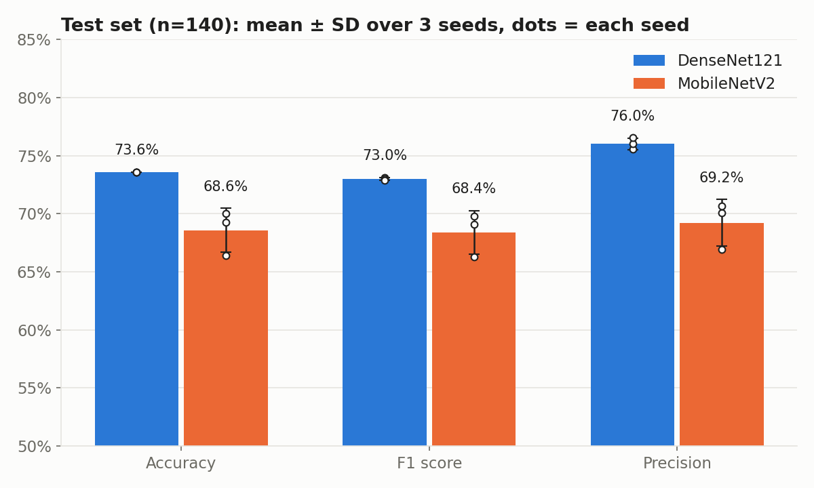
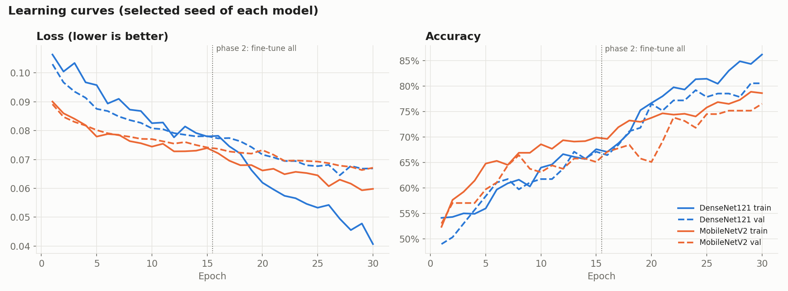
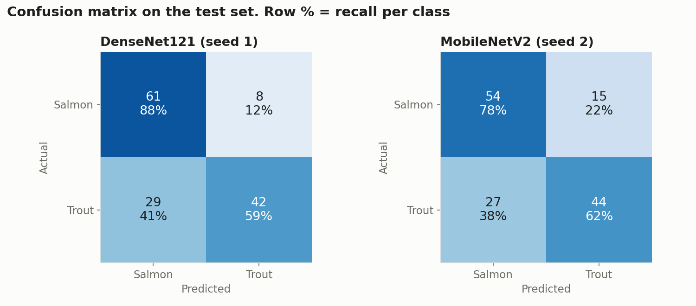
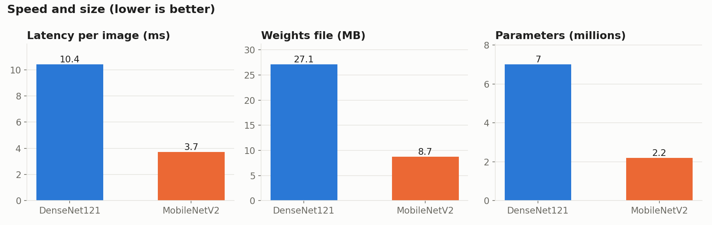
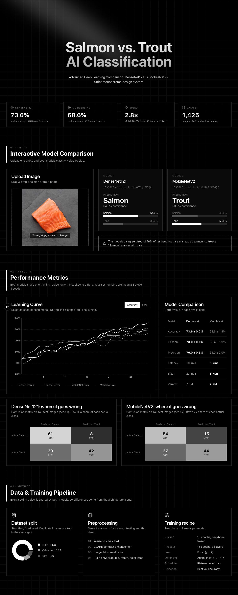

# 🐟 Salmon vs Trout Classification Project

This project uses **Deep Learning** to classify images of **Salmon** and **Trout**, and runs a **controlled comparison** of two architectures, **DenseNet121** and **MobileNetV2**. Both models use the exact same training recipe, data split and evaluation protocol, so any difference in results comes from the backbone alone. A **Next.js Dashboard** shows real-time inference and the comparison.

---

## 🚀 Key Features

*   **Fair Model Comparison**:
    *   **DenseNet121**: deep, densely connected backbone.
    *   **MobileNetV2**: lightweight backbone built from depthwise separable convolutions.
    *   **One shared recipe** (`ml/config.py`): **2-phase training**. The backbone is frozen at first so only the head trains, then everything is fine-tuned at lr ×0.1. Both models also share **Focal Loss** and ReduceLROnPlateau.
    *   **3 seeds per model**: results are reported as mean ± SD.
*   **Interactive Dashboard**:
    *   Built with **Next.js 16 (App Router)** and **Tailwind CSS 4**.
    *   **Real-time Inference**: Upload an image to see immediate classification results from both models simultaneously.
    *   **Visual Analytics**: Interactive charts (Recharts) showing Training Loss, Accuracy, and Dataset Splits.
    *   **Modern UI**: Features Glassmorphism, Spotlight effects, and a strict **Monochrome** design system.
*   **Data Pipeline**:
    *   **Preprocessing**: CLAHE (Contrast Limited Adaptive Histogram Equalization) for texture enhancement, used in training, evaluation and inference.
    *   **Augmentation**: Random Resized Crop, Horizontal Flip, Rotation, Color Jitter and Translation, all at 224x224.
    *   **Split Strategy**: stratified 80% Train / 10% Validation / 10% Test with a fixed seed. The split is saved in `ml/splits.json`, and byte-identical images are grouped so they never leak across splits.

---

## 🛠️ Tech Stack

### **Frontend (Dashboard)**
*   **Framework**: Next.js 16 (React 19, TypeScript)
*   **Styling**: Tailwind CSS 4, Framer Motion, Aceternity UI, Shadcn UI
*   **Visualization**: Recharts, Lucide React

### **Backend & AI**
*   **API**: Next.js API Routes (Serverless Functions)
*   **Deep Learning**: PyTorch, Torchvision
*   **Image Processing**: PIL (Pillow), OpenCV (for CLAHE)
*   **Environment**: Python 3.x (MPS/CUDA support)

---

## 📂 Project Structure

```bash
.
├── dashboard/          # Next.js Web Application
│   ├── src/            # Source code (App Router, Components, /api/predict)
│   └── public/data/    # Metrics & training history JSON written by ml/train.py
├── ml/                 # All Python code, shared by both models
│   ├── config.py       # Single training/evaluation config for both models
│   ├── models.py       # DenseNet121 + MobileNetV2 definitions and registry
│   ├── data.py         # Split, CLAHE, transforms, data loaders
│   ├── train.py        # Trains both models with the identical recipe
│   ├── evaluate.py     # Test metrics + latency measurement
│   ├── inference.py    # Single-image prediction (used by the dashboard)
│   ├── plot_results.py # Comparison figures -> Docs/figures/
│   └── splits.json     # Fixed train/val/test split
├── Image/              # Dataset: Image/Salmon, Image/Trout (not in git)
├── Docs/               # Documentation, references and result figures (Docs/figures)
└── README.md           # Project Overview (This file)
```

---

## ⚡ Getting Started

### 1. Prerequisites
*   **Node.js** (v18 or higher)
*   **Python** (v3.9 or higher)
*   **Pip** & **Virtualenv** (Recommended)

### 2. Setup Python Environment & Train
```bash
python3 -m venv venv
source venv/bin/activate
pip install -r ml/requirements.txt

# Put the dataset at Image/Salmon and Image/Trout, then:
python ml/test_setup.py                  # quick sanity checks
python ml/train.py --model all --quick   # smoke test (1+1 epochs, one seed)
python ml/train.py --model all           # full run: 3 seeds per model
```

### 3. Run the Dashboard
```bash
cd dashboard

# Install dependencies
npm install

# Start the development server
npm run dev
```
Open [http://localhost:3000](http://localhost:3000) in your browser.

---

## 🔬 Model Comparison

Both models share every setting: data split, preprocessing, augmentation, epochs (15 frozen + 15 fine-tune), optimizer, learning rate, scheduler, loss and seeds. Only the backbone differs.

### Results (test set, 140 images, mean ± SD over 3 seeds)

| Metric | DenseNet121 | MobileNetV2 |
| :--- | :--- | :--- |
| **Accuracy** | **73.6 ± 0.0%** | 68.6 ± 1.9% |
| **F1 score** | **73.0 ± 0.1%** | 68.4 ± 1.9% |
| **Precision** | **76.0 ± 0.5%** | 69.2 ± 2.0% |
| **Latency / image** | 10.4 ms | **3.7 ms** (2.8× faster) |
| **Weights size** | 27.1 MB | **8.7 MB** |
| **Parameters** | 7.0M | **2.2M** |

Latency is measured the same way for both models: batch size 1, 10 warm-up runs, then the mean of 50 synchronized runs on the same device (Apple MPS).



**Takeaways**
- **DenseNet121 is about 5 points more accurate** and much more stable across seeds.
- **MobileNetV2 is 2.8× faster and 3× smaller.** It is the better choice for mobile or edge deployment if the accuracy drop is acceptable.
- **Both models confuse trout for salmon.** Only about 60% of trout are recognized, compared with 78–88% of salmon. Because it happens with both backbones, the cause is likely the data or the recipe rather than the architecture.
- **Both models are still undertrained.** The best epoch was 25–29 out of 30 for every seed, and validation accuracy was still rising.





Regenerate the figures after retraining:
```bash
python ml/plot_results.py   # writes Docs/figures/*.png
```

---

## 📸 Screenshots



---

## 📝 License

This project is open-source and available under the [MIT License](LICENSE).
